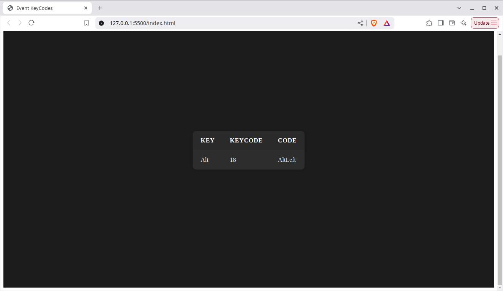

# ⌨️ Interactive Key Display – Modern Dark Theme Project

This project is a sleek, interactive UI built with HTML, CSS, and JavaScript that detects and displays any key you press on your keyboard. It's designed with a minimal dark theme and smooth user experience, making it perfect for learners and developers experimenting with keyboard events.

## 🌟 Features

- 🎨 Clean modern dark UI
- ⌨️ Real-time keyboard key detection and display
- 🖼️ Smart box layout with styled key info
- ⚡ Smooth transitions and responsive design
- 💻 Built with pure HTML, CSS, and vanilla JavaScript

## 🛠️ How It Works

- When a key is pressed, the script listens for the `keydown` event.
- It extracts the key name, key code, and other properties.
- The UI updates in real-time to show the pressed key inside a styled container.

## 📸 Preview

> _Tip: Add a real screenshot of UI and name it `keychange.png`_

👤 Author

Larida Kharpran
📧 laridakharpran@gmail.com
